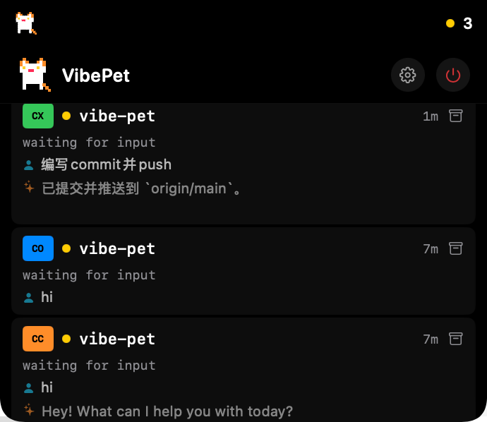

# VibePet

macOS 刘海区域的 AI 编程会话监控工具。当你同时开多个 Claude Code / Codex / Coco 会话时，VibePet 帮你追踪每个会话的状态，在需要操作时用提示音通知你。

一只像素猫住在你的刘海旁边，陪你写代码。


## 功能

- 刘海旁显示像素猫动画 + 活跃会话数
- 悬停展开查看所有会话状态（工作中 / 等待输入 / 需要审批）
- 显示每个会话的用户 prompt 和 AI 回复摘要
- 不同事件播放 8-bit 风格提示音（会话开始、完成、需要操作等）
- 点击会话跳转到对应的终端窗口
- 会话持久化，重启后自动恢复
- 首次启动自动配置 hooks，无需手动操作


## 支持的工具

| 工具 | 配置文件 | 标识 |
|------|---------|------|
| Claude Code | `~/.claude/settings.json` | CC (橙色) |
| Codex CLI | `~/.codex/hooks.json` | CX (绿色) |
| Coco (Trae CLI) | `~/.trae/traecli.yaml` | CO (蓝色) |

仅在对应工具的配置目录存在时才写入 hooks。

## 环境要求

- macOS 14.0 (Sonoma) 或更高版本

## 安装

### 从 DMG 安装

下载 [`VibePet-1.0.0.dmg`](https://bytedance.larkoffice.com/wiki/W0K4wdTPSijYIFkdfascj7agnhe)，打开后将 VibePet 拖入 Applications 文件夹。

### 从源码构建

```bash
git clone <repo-url>
cd vibe-pet
make run        # 构建并启动
make dmg        # 打包 DMG（需要 brew install create-dmg）
```

## 使用

启动后 VibePet 会：
1. 在刘海两侧显示像素猫和会话计数
2. 自动向已安装的 AI 工具写入 hook 配置
3. 监听会话事件并实时更新状态

悬停刘海区域展开会话列表，点击会话跳转到终端。点击齿轮图标打开设置。

## 设置

- 提示音开关和音量
- 查看各工具 hook 状态
- 重新安装 / 卸载 hooks
- 清理已归档会话

## 技术栈

- Swift + SwiftUI + AppKit
- Swift Package Manager（无外部依赖）
- macOS 14.0+
- Unix domain socket IPC
- AVAudioEngine 程序化生成音效
